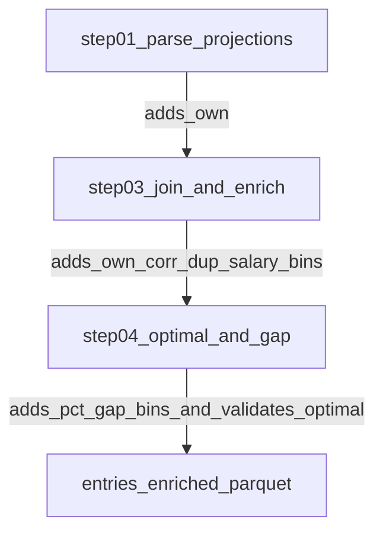

# Plan: Implement new features from `prompts/features.md`

## Goals
- Implement the requested features in Pipeline A (training):
  - `own_score_logprod`, `own_max_log`, `own_min_log`
  - `avg_corr`
  - `pct_contest_lineups`
  - `pct_proj_gap_to_optimal`, `pct_proj_gap_to_optimal_bin`
  - `salary_left_bin`
- Ensure these appear in:
  - Step 4 artifacts: `artifacts/.../steps/04_optimal_and_gap/preview.csv` + `schema.json`
  - Final output: `artifacts/.../entries_enriched.parquet`
- Enforce: **`optimal_proj_points` must be finite and > 0; otherwise raise**.

## Where each feature will live (by pipeline step)

### Step 01 `parse_projections`: carry ownership into `players_all`
- Update `[src/dfs_opt/parsing/sabersim.py](/home/john/showdown-optimizer-v2/src/dfs_opt/parsing/sabersim.py)` to parse projected ownership from Sabersim:
  - Source column: **`My Own`** (percent in [0,100])
  - New canonical column: `own` (probability in [0,1] via `/ 100.0`)
  - Keep the existing “FLEX row selection” rule (min salary per `name_norm`), meaning CPT is treated the same as UTIL for ownership, per `prompts/features.md`.
- Update Step 01 outputs to include `own` so later steps can join it to lineup slots.

### Step 00/ingest inventory: discover correlation matrix per slate
- Update `[src/dfs_opt/io/inventory.py](/home/john/showdown-optimizer-v2/src/dfs_opt/io/inventory.py)`:
  - Extend `SlateInputs` to include `corr_matrix_csv: Optional[Path]`.
  - In `load_slate_inputs`, detect `*_corr_matrix.csv` in the slate folder.
- This keeps the correlation matrix path available to step 03.

### Step 03 `join_and_enrich`: lineup-level ownership + contest% + avg_corr + salary_left_bin
- Update `[src/dfs_opt/features/enrich_showdown.py](/home/john/showdown-optimizer-v2/src/dfs_opt/features/enrich_showdown.py)`:
  - Extend `players_flex` required columns to include `own`.
  - Join `own` for each slot: `cpt_own`, `util1_own`…`util5_own`.
  - Compute ownership features (with epsilon clamp for log safety):
    - `own_score_logprod`: 
      - `sum(log(own_i))` across all 6 rostered players
      - CPT treated same as UTIL (no 1.5 multiplier).
    - `own_max_log`: `max(log(own_i))`
    - `own_min_log`: `min(log(own_i))`
  - Compute `pct_contest_lineups`:
    - Define `contest_size = entries.groupby('contest_id').size()` **before dropping missing joins**.
    - After `dup_count` exists on `df_ok`, compute `pct_contest_lineups = dup_count / contest_size`.
  - Compute `salary_left_bin` using bins: `0-200`, `200-500`, `500-1000`, `1000-2000`, `2000+`.
    - Use stable string labels (e.g. `"0_200"`, `"200_500"`, `"500_1000"`, `"1000_2000"`, `"2000_plus"`).
  - Compute `avg_corr`:
    - Add a new helper (either inside this module or a small new module like `[src/dfs_opt/features/correlation.py](/home/john/showdown-optimizer-v2/src/dfs_opt/features/correlation.py)`) to:
      - Load the slate’s `*_corr_matrix.csv`
      - Normalize matrix row/col player names with `dfs_opt.parsing.names.norm_name`
      - For each lineup, compute the average over all 15 pairs.
      - If a player/pair is missing from the matrix, treat that pair correlation as **0** and still divide by 15 (per spec’s fixed denominator).
- Update `[src/dfs_opt/pipelines/training.py](/home/john/showdown-optimizer-v2/src/dfs_opt/pipelines/training.py)` step 03 loop to pass the slate’s `corr_matrix_csv` into `enrich_showdown_entries` (or into the correlation helper) using a `slate_id -> corr_matrix_csv` map from `slate_inputs`.

### Step 04 `optimal_and_gap`: pct gap + bins, plus strict validation
- Update `[src/dfs_opt/features/optimal.py](/home/john/showdown-optimizer-v2/src/dfs_opt/features/optimal.py)` and/or step 04 logic in `[src/dfs_opt/pipelines/training.py](/home/john/showdown-optimizer-v2/src/dfs_opt/pipelines/training.py)`:
  - After computing optimal:
    - Validate `optimal_proj_points` is finite and > 0; else `raise ValueError` with slate_id context.
  - Add:
    - `pct_proj_gap_to_optimal = proj_gap_to_optimal / optimal_proj_points`
    - Clamp tiny negatives to 0 (defensive for floating error), then bin into:
      - `0-0.01`, `0.01-0.02`, `0.02-0.04`, `0.04-0.07`, `0.07+`
    - Stable labels (e.g. `"0_0.01"`, `"0.01_0.02"`, `"0.02_0.04"`, `"0.04_0.07"`, `"0.07_plus"`) stored in `pct_proj_gap_to_optimal_bin`.

## Data contracts + artifacts
- Update `[agent/DATA_CONTRACTS.md](/home/john/showdown-optimizer-v2/agent/DATA_CONTRACTS.md)` to document the new required output columns:
  - `own_score_logprod`, `own_max_log`, `own_min_log`
  - `avg_corr`
  - `pct_contest_lineups`
  - `pct_proj_gap_to_optimal`, `pct_proj_gap_to_optimal_bin`
  - `salary_left_bin`
- No change needed to `[src/dfs_opt/io/artifacts.py](/home/john/showdown-optimizer-v2/src/dfs_opt/io/artifacts.py)`: step previews/schemas are derived from the step output DataFrames, so once columns are added, step 4 artifacts will reflect them automatically.

## Tests / validation
- Extend unit tests to prevent regressions:
  - `[tests/test_enrich_showdown.py](/home/john/showdown-optimizer-v2/tests/test_enrich_showdown.py)`:
    - Add a test that supplies `own` and verifies the three ownership log features.
    - Add a test for `pct_contest_lineups`.
    - Add a test for `salary_left_bin`.
    - Add a small synthetic correlation matrix file + verify `avg_corr`.
  - Add/extend a test that asserts step 4 outputs include the new columns (likely `[tests/test_training_pipeline_artifacts.py](/home/john/showdown-optimizer-v2/tests/test_training_pipeline_artifacts.py)`).
  - Add a test asserting the new “optimal must be finite and > 0” behavior (e.g., with <6 players).

## Implementation notes (to match `prompts/features.md` exactly)
- Ownership uses **`My Own`** from Sabersim projections; convert `% -> probability`.
- CPT treated the same as UTIL for ownership features.
- `avg_corr` uses fixed denominator 15.
- `pct_contest_lineups` uses duplicates over total entrants.
- `pct_proj_gap_to_optimal` is ratio; bins use decimals.

