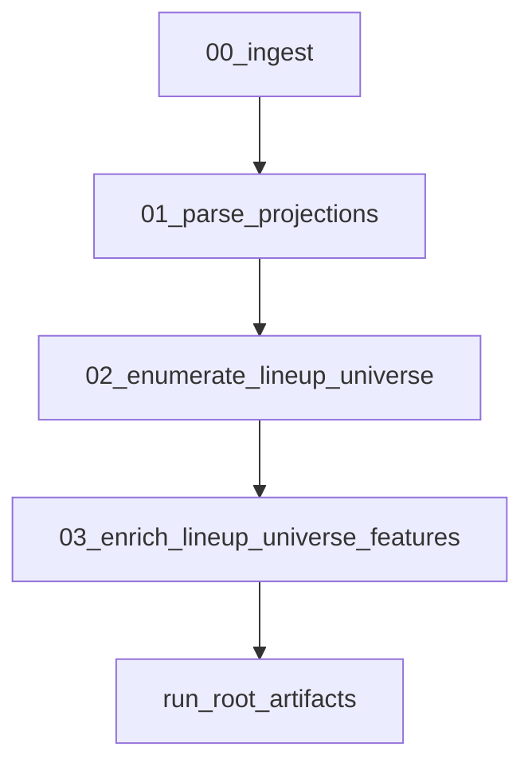

# Enrich enumerated lineup universe with dup-model features

## Goal
Extend the NBA showdown lineup universe dataset (currently `cpt,u1..u5,salary_used,salary_left,proj_points,stack_code`) with the following additional columns so it’s ready for the softmax duplication model:
- `own_score_logprod`, `own_max_log`, `own_min_log`
- `avg_corr` (per your choice)
- `cpt_archetype`
- `salary_left_bin`
- `pct_proj_gap_to_optimal`, `pct_proj_gap_to_optimal_bin`

## Key design choices (locked)
- **Correlation column name**: write `avg_corr` (consistent with existing training outputs in `src/dfs_opt/features/enrich_showdown.py`).
- **Correlation source**: require `corr_matrix_csv` in Pipeline B config (error if missing).

## Where this fits in the codebase
- **Pipeline B runner**: add a new step after enumeration in `[src/dfs_opt/pipelines/contest.py](/home/john/showdown-optimizer-v2/src/dfs_opt/pipelines/contest.py)`.
- **Existing feature logic to reuse**:
  - Ownership + salary binning + CPT archetype logic already exists in `[src/dfs_opt/features/enrich_showdown.py](/home/john/showdown-optimizer-v2/src/dfs_opt/features/enrich_showdown.py)`.
  - Correlation lookup utilities are in `[src/dfs_opt/features/correlation.py](/home/john/showdown-optimizer-v2/src/dfs_opt/features/correlation.py)`.
  - Optimal projection computation is in `[src/dfs_opt/features/optimal.py](/home/john/showdown-optimizer-v2/src/dfs_opt/features/optimal.py)`.

## Implementation steps

### 1) Extend Pipeline B config to accept correlation input and archetype tiers
- Update `[src/dfs_opt/config/settings.py](/home/john/showdown-optimizer-v2/src/dfs_opt/config/settings.py)`:
  - Add `corr_matrix_csv: Path` to `ContestConfig` (required).
  - Add `captain_tiers: List[Tuple[int,str]]` to `ContestConfig` (default to `SegmentDefinitions().captain_tiers`) so `cpt_archetype` is computed identically to training.
  - Add `own_log_eps: float = 1e-6` (optional) to make ownership log clamping configurable.

### 2) Add a new step in Pipeline B: `03_enrich_lineup_universe_features`
In `[src/dfs_opt/pipelines/contest.py](/home/john/showdown-optimizer-v2/src/dfs_opt/pipelines/contest.py)` after `02_enumerate_lineup_universe`:
- Read `players_enum_df` (already in memory) and `lineups.parquet` (or use `res` arrays) to compute features.
- Write a new artifact at run root:
  - **Preferred**: `lineups_enriched.parquet` (keeps `lineups.parquet` stable per contract, avoids surprise schema changes).
  - Also write/update step outputs in `steps/03_enrich_lineup_universe_features/` with `preview.csv` and `schema.json` via `ArtifactWriter`.
- Update run `metadata.json` to include the schema for the enriched file (and optionally include category maps for bins/archetypes).

### 3) Compute each requested feature (vectorized / scalable)
Use player-indexed arrays (aligned with `players_enum_df` ordering) so we can compute features for millions of lineups efficiently.

- **Ownership features** (`own_score_logprod`, `own_max_log`, `own_min_log`):
  - Build `own: float32[n_players]` from `players_enum_df['own']`.
  - For each lineup, gather 6 ownership values by indices `cpt,u1..u5`.
  - Clamp with `own_log_eps`, take log, then:
    - `own_score_logprod = sum(log_own)`
    - `own_max_log = max(log_own)`
    - `own_min_log = min(log_own)`

- **Correlation feature** (`avg_corr`):
  - Load correlation matrix from `ContestConfig.corr_matrix_csv` using `load_corr_matrix_csv`.
  - Build a dense `corr_mat: float32[n,n]` aligned to the enumerated player order (`players_enum_df['name_norm']`), defaulting missing pairs to 0.0.
  - Compute average pairwise correlation across the 6 players per lineup, denominator fixed at 15 (C(6,2)).
  - For performance, implement this as a **Numba kernel** similar to enumeration (`parallel=True`) that takes lineup index arrays + `corr_mat` and returns `avg_corr`.

- **CPT archetype** (`cpt_archetype`):
  - Compute `salary_rank` on the enumerated slate players from FLEX salary (descending) using the same rules as `enrich_showdown_entries`.
  - Map CPT’s salary rank into tiers from `ContestConfig.captain_tiers`.

- **Salary left bin** (`salary_left_bin`):
  - Use bins documented in `agent/DATA_CONTRACTS.md`:
    - `0_200`, `200_500`, `500_1000`, `1000_2000`, `2000_plus`
  - Encode as an Arrow dictionary (or pandas category) to keep the parquet compact.

- **Pct gap to optimal** (`pct_proj_gap_to_optimal`, `pct_proj_gap_to_optimal_bin`):
  - Compute `optimal_proj_points` once per slate using `compute_optimal_showdown_proj(players_enum_df, salary_cap=config.salary_cap, min_proj_points=config.min_proj_points)`.
  - For each lineup:
    - `pct_proj_gap_to_optimal = (optimal_proj_points - proj_points) / optimal_proj_points`, clipped to `>= 0`.
  - Bin using the same edges as training:
    - `0_0.01`, `0.01_0.02`, `0.02_0.04`, `0.04_0.07`, `0.07_plus`
  - Also store `optimal_proj_points` in metadata (and optionally as a column if you want fully self-contained rows).

### 4) Update contracts + docs to reflect the new enriched output
- Update `[agent/DATA_CONTRACTS.md](/home/john/showdown-optimizer-v2/agent/DATA_CONTRACTS.md)`:
  - Keep the base `lineups.parquet` schema as-is.
  - Add a subsection for `lineups_enriched.parquet` with the new columns and definitions.
- Update `[agent/PIPELINES.md](/home/john/showdown-optimizer-v2/agent/PIPELINES.md)`:
  - Add step `03. enrich_lineup_universe_features` under Pipeline B.
  - Document required input `corr_matrix_csv` and produced artifacts.

### 5) Add/extend tests
- Extend `[tests/test_lineup_universe_showdown.py](/home/john/showdown-optimizer-v2/tests/test_lineup_universe_showdown.py)` or add a new test file to validate:
  - The new step writes `lineups_enriched.parquet`.
  - Output contains the exact requested columns.
  - Basic sanity checks:
    - `own_min_log <= own_max_log`
    - bins are within allowed label set
    - `pct_proj_gap_to_optimal >= 0`
    - `avg_corr` is finite

## Data flow (Pipeline B)

## Deliverables
- `lineups_enriched.parquet` with:
  - existing: `cpt,u1..u5,salary_used,salary_left,proj_points,stack_code`
  - added: `own_score_logprod,own_max_log,own_min_log,avg_corr,cpt_archetype,salary_left_bin,pct_proj_gap_to_optimal,pct_proj_gap_to_optimal_bin`
- Updated `metadata.json` schema and step manifests.
- Updated agent docs (`DATA_CONTRACTS.md`, `PIPELINES.md`).
- Tests covering schema + basic invariants.
