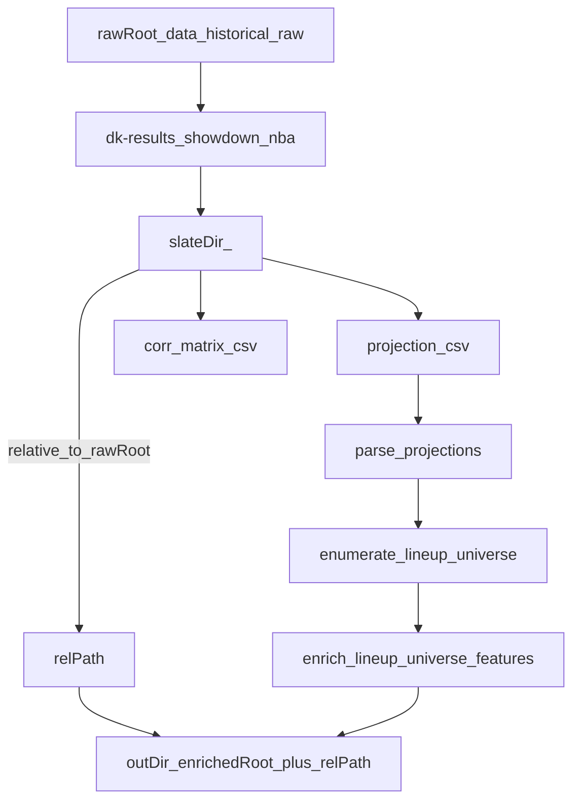

# Enumerate NBA showdown lineup universe (historical)

## Goal

Create a script `scripts/enumerate_nba_showdown_lineups.py` that:

- Finds **all NBA showdown slates** under `data/historical/raw/dk-results/showdown/nba/`.
- For each slate, runs the **lineup-gen slice** of Pipeline B: **ingest → parse projections → enumerate lineup universe → enrich lineup-universe features**.
- Writes outputs into a **mirrored directory structure** under `data/historical/enriched/`.
- **Skips** a slate if its `lineups_enriched.parquet` already exists in the target enriched folder.

## Key existing code to reuse

- Pipeline B lineup-gen implementation and the exact computations for enumeration + enrichment:
  - [`/home/john/showdown-optimizer-v2/src/dfs_opt/pipelines/contest.py`](/home/john/showdown-optimizer-v2/src/dfs_opt/pipelines/contest.py)( /home/john/showdown-optimizer-v2/src/dfs_opt/pipelines/contest.py ) (uses `parse_sabersim_showdown_csv`, `prepare_player_arrays`, `enumerate_showdown_universe`, `enrich_lineup_universe_showdown`, `compute_optimal_showdown_proj`)
- Existing slate discovery helpers (useful patterns, but we’ll tailor for the historical NBA folder):
  - [`/home/john/showdown-optimizer-v2/src/dfs_opt/io/inventory.py`](/home/john/showdown-optimizer-v2/src/dfs_opt/io/inventory.py)( /home/john/showdown-optimizer-v2/src/dfs_opt/io/inventory.py )

## Output path mapping (mirror raw → enriched)

- Define:
  - `raw_root = data/historical/raw`
  - `enriched_root = data/historical/enriched`
- Each slate dir is:
  - `slate_dir = raw_root / "dk-results/showdown/nba/<slate_id>/"`
- Output dir is:
  - `out_dir = enriched_root / slate_dir.relative_to(raw_root)`
  - Example:
    - Raw: `data/historical/raw/dk-results/showdown/nba/2025-12-07-OKC-UTA/`
    - Enriched: `data/historical/enriched/dk-results/showdown/nba/2025-12-07-OKC-UTA/`

## What gets written per slate

In `out_dir/` write the stable, slate-level artifacts (no run_id subfolder):

- `players.parquet`
- `lineups.parquet`
- `lineups_enriched.parquet`
- `metadata.json`

Optionally (recommended) also write Pipeline-style step folders for debugging/inspection:

- `steps/00_ingest/preview.csv`, `schema.json`, `step_manifest.json`
- `steps/01_parse_projections/...`
- `steps/02_enumerate_lineup_universe/...`
- `steps/03_enrich_lineup_universe_features/...`

(We can either reuse `ArtifactWriter` semantics by re-implementing a small “step writer” inside the script, or keep it minimal and only write the four core artifacts above. The plan implementation will include the step folders since your pipeline conventions already use them.)

## Slate input file discovery rules

Within each `slate_dir`:

- **Projection CSV**:
  - Choose a `*.csv` that is **not** `*_corr_matrix.csv` and does **not** end with `:Zone.Identifier`.
- **Correlation matrix CSV**:
  - Must match `*_corr_matrix.csv` (same folder as projections).

This matches your note (“correlation matrix csv is in the same folder as the projections csv for each slate”) and avoids Windows metadata sidecars.

## Skip logic

Before doing any work for a slate:

- If `(out_dir / "lineups_enriched.parquet").exists()` → **skip slate**.

## Script behavior & CLI

Implement `scripts/enumerate_nba_showdown_lineups.py` with:

- A `main()` that:
  - Iterates `data/historical/raw/dk-results/showdown/nba/*/` in sorted order.
  - For each slate:
    - Resolve `projection_csv` + `corr_matrix_csv`.
    - Build a `ContestConfig`-compatible set of parameters (salary cap, min proj points, tiers, own_log_eps).
    - Run:
      - ingest inventory (just record paths + sha256)
      - parse projections (`parse_sabersim_showdown_csv`)
      - enumerate (`prepare_player_arrays` + `enumerate_showdown_universe`)
      - compute optimal (`compute_optimal_showdown_proj`)
      - enrich (`enrich_lineup_universe_showdown`)
    - Write artifacts into `out_dir`.
- CLI args (with sensible defaults matching `ContestConfig` in [`/home/john/showdown-optimizer-v2/src/dfs_opt/config/settings.py`](/home/john/showdown-optimizer-v2/src/dfs_opt/config/settings.py)( /home/john/showdown-optimizer-v2/src/dfs_opt/config/settings.py )):
  - `--raw-root` (default: `data/historical/raw`)
  - `--enriched-root` (default: `data/historical/enriched`)
  - `--salary-cap` (default 50000)
  - `--min-proj-points` (default 0.0)
  - `--max-players` (default None)
  - `--own-log-eps` (default 1e-6)
  - `--seed` (default 1337)
  - `--persist-steps/--no-persist-steps` (whether to write `steps/*` sidecars)
  - `--fail-fast/--no-fail-fast` (stop on first error vs continue and report failures)

## Observability

- Print one-line progress per slate:
  - `slate_id`, whether skipped, and counts (`num_players`, `num_lineups`), plus output path.
- At end, print summary:
  - total slates, processed, skipped, failed.

## Mermaid overview

## Files to change/add

- Add: [`/home/john/showdown-optimizer-v2/scripts/enumerate_nba_showdown_lineups.py`](/home/john/showdown-optimizer-v2/scripts/enumerate_nba_showdown_lineups.py)( /home/john/showdown-optimizer-v2/scripts/enumerate_nba_showdown_lineups.py )

## Implementation todos

- `scan-slates`: Enumerate slate directories under `data/historical/raw/dk-results/showdown/nba/` and map each to an output dir under `data/historical/enriched/`.
- `input-discovery`: Implement robust discovery of `projection_csv` + `*_corr_matrix.csv` within each slate folder (ignore `:Zone.Identifier`).
- `run-pipeline-steps`: Reuse the same core functions as `run_contest_lineup_gen` to parse/enumerate/enrich and to compute `metadata.json`.
- `write-outputs`: Write `players.parquet`, `lineups.parquet`, `lineups_enriched.parquet`, `metadata.json` (and `steps/*` sidecars if enabled).
- `skip-and-reporting`: Implement skip logic (`lineups_enriched.parquet` exists) plus end-of-run summary and nonzero exit code if failures occurred (unless `--no-fail-fast`).