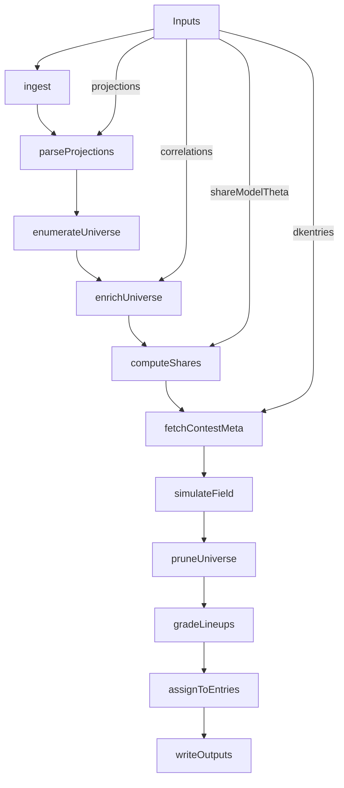

# Pipeline B (Contest Execution) Implementation Plan

## Context and scope

- **Goal**: Upgrade the existing “lineup-gen slice” to the full **Pipeline B** described in [`agent/PIPELINES.md`](/home/john/showdown-optimizer-v2/agent/PIPELINES.md) using the contest sim spec in [`prompts/contest-sim.md`](/home/john/showdown-optimizer-v2/prompts/contest-sim.md).
- **Inputs live in**: [`data/inputs/`](/home/john/showdown-optimizer-v2/data/inputs) (projections, correlations, DKEntries).
- **Bucket selection**: **Fetch contest metadata from DraftKings API**, then derive the model bucket (gpp_category) from that metadata (contest size + max entries per user).
- **Non-goals (for now)**: Target-distribution-based field construction (explicitly excluded by Pipeline B note).

## High-level dataflow

## Target CLI + config surface

- Extend the contest CLI from [`src/dfs_opt/cli/contest.py`](/home/john/showdown-optimizer-v2/src/dfs_opt/cli/contest.py):
  - Keep existing `dfs-opt contest lineup-gen` (backward compatible).
  - Add `dfs-opt contest run` (full Pipeline B):
    - `--projection-csv` (raw Sabersim)
    - `--corr-matrix-csv`
    - `--dkentries-csv`
    - `--slate-id`, `--sport`
    - `--share-models-root` (root that contains `share_models/<gpp_category>/theta.json`)
    - Simulation knobs: `--num-sims`, `--prune-mass-threshold`, `--dirichlet-alpha` (optional), `--top-percent-thresholds` (defaults `[0.001,0.01,0.05,0.20]`)
    - Output knobs: `--artifacts-root`, `--persist-step-outputs`, `--seed`, `--log-level`
    - DK API knobs: `--dk-api-base-url` (default to a public DK endpoint), `--dk-api-cache-dir` (default inside run artifacts), optional auth via env/config.
- Extend `ContestConfig` in [`src/dfs_opt/config/settings.py`](/home/john/showdown-optimizer-v2/src/dfs_opt/config/settings.py) and load/override logic in [`src/dfs_opt/config/load.py`](/home/john/showdown-optimizer-v2/src/dfs_opt/config/load.py) to include the above.

## Step-by-step implementation (maps to PIPELINES.md)

### Step 00 — ingest

- **Where**: Extend orchestrator in [`src/dfs_opt/pipelines/contest.py`](/home/john/showdown-optimizer-v2/src/dfs_opt/pipelines/contest.py).
- **What**:
  - Inventory: projections, correlation matrix, DKEntries CSV, and the theta model path(s) selected.
  - Record checksums via `sha256_file` and write `00_ingest` step artifacts using `ArtifactWriter` ([`src/dfs_opt/io/artifacts.py`](/home/john/showdown-optimizer-v2/src/dfs_opt/io/artifacts.py)).

### Step 01 — parse_projections

- **Where**: [`src/dfs_opt/parsing/sabersim.py`](/home/john/showdown-optimizer-v2/src/dfs_opt/parsing/sabersim.py) and contest pipeline.
- **What**:
  - Continue producing canonical `players_flex`.
  - **Add optional variance columns** needed for outcome simulation:
    - Parse `dk_std` (present in your NBA file) if available and store as `dk_std`/`std_points`.
    - Parse `DFS ID` if available to support DK upload formatting later.

### Step 02 — enumerate_lineup_universe

- **Where**: Keep using [`src/dfs_opt/lineup_pool/enumerate_universe_showdown.py`](/home/john/showdown-optimizer-v2/src/dfs_opt/lineup_pool/enumerate_universe_showdown.py).
- **What**:
  - No major change, but ensure `players.parquet` includes whatever is needed downstream for assignment (`name_norm`, display name, DFS ID).

### Step 03 — enrich_lineup_universe_features

- **Where**: Keep using [`src/dfs_opt/lineup_pool/enrich_universe_showdown.py`](/home/john/showdown-optimizer-v2/src/dfs_opt/lineup_pool/enrich_universe_showdown.py).
- **What**:
  - Already computes the exact share-model features + `avg_corr` needed.
  - Add (or compute in step 04) a stable `lineup_hash` for each lineup row for downstream joins/debug.

### Step 04 — compute_softmax_shares

- **Where**: Add “apply theta” utilities in [`src/dfs_opt/share_model/softmax_share.py`](/home/john/showdown-optimizer-v2/src/dfs_opt/share_model/softmax_share.py) (training code exists; contest-time scoring does not).
- **What**:
  - Load `theta.json`, validate feature schema compatibility.
  - Load the lineup universe features from the current run’s `lineups_enriched.parquet` and compute utilities:
    - Use stable log-sum-exp to compute `logp` and `p` (as in contest-sim spec).
  - Write `lineup_utilities.parquet` (ideally with `lineup_id` (row index), `lineup_hash`, `u`, `logp`, `p`).
  - Metrics: entropy / top-k cumulative mass.

### Step 05 — simulate_contests_from_dkentries

- **Where**: Create new modules under `src/dfs_opt/io/` and `src/dfs_opt/simulation/` (currently missing; architecture expects `simulation/`).
- **DKEntries parsing**:
  - Add `dfs_opt.io.dkentries` module to read DKEntries, normalize column variants to canonical `entry_id`, `contest_id`, and slot columns (`cpt`, `util1..util5`) per [`agent/DATA_CONTRACTS.md`](/home/john/showdown-optimizer-v2/agent/DATA_CONTRACTS.md).
  - Preserve passthrough columns and preserve output slot formatting as “Name (ID)” by default.
- **DraftKings API client (contest metadata)**:
  - Add `dfs_opt.io.dk_api` with a small client:
    - `fetch_contest(contest_id) -> ContestMeta` including `contest_size` (N), `entry_fee`, `max_entries_per_user`, and payout structure (rank→payout).
    - Implement **disk caching** inside the run artifacts so reruns are deterministic and reduce API load.
    - Add config hooks for base URL and optional auth (env/cookies) if the endpoint isn’t fully public.
- **Bucket derivation**:
  - Implement `derive_gpp_category(meta, sport, segment_definitions)`:
    - `entry_type`: `single-entry` if `max_entries_per_user` in `[1..5]`, else `mme`.
    - `size_bin`: use `SegmentDefinitions.size_bins` (already in `ContestConfig` defaults) to select label.
    - Validate derived key against the static registry via `load_gpp_bins_registry()` ([`src/dfs_opt/config/gpp_bins.py`](/home/john/showdown-optimizer-v2/src/dfs_opt/config/gpp_bins.py)).
  - Load the appropriate `theta.json` for each contest.
- **Field sampling**:
  - For each contest group in DKEntries:
    - Sample N lineups **with replacement** from `p(L)`.
    - Store `field_sample.parquet` as compact `{lineup_id -> dup_count}`.
    - Optional: implement Dirichlet–multinomial heavier-tail duplication when `dirichlet_alpha` is set.

### Step 05b — pruning (within the same step, but write artifacts separately)

- Implement probability-mass pruning per [`prompts/contest-sim.md`](/home/john/showdown-optimizer-v2/prompts/contest-sim.md):
  - Sort by `p(L)` desc and keep the smallest prefix with cumulative mass ≥ `prune_mass_threshold`.
  - **Safety**: force-include all lineups that appear in the sampled field and all user-candidate lineups (if scoring a provided set).
  - Write `pruned_universe.parquet` (lineup rows + `p` and `lineup_hash`).

### Step 06 — grade_lineups

- **Where**: new `src/dfs_opt/simulation/` package.
- **Outcome model**:
  - Use correlated normal draws for player outcomes:
    - mean = `proj_points`.
    - std = `dk_std` from projections if present; otherwise fall back to a configurable rule (e.g., `std = std_scale * sqrt(max(proj, eps))`) and record this in manifests.
    - correlation = correlation matrix aligned to `players.parquet` (`build_dense_corr_matrix` already exists).
  - Convert player outcomes → lineup fantasy points (CPT 1.5x).
- **Contest scoring**:
  - For each sim draw:
    - rank field lineups by points
    - apply payout table
    - split payouts across duplicates (`payout / dup_count`)
  - Produce per-lineup aggregates:
    - ROI
    - top-% finish rates for configured thresholds
  - Write `lineup_grades.parquet` per contest.

### Step 07 — assign_best_lineups_to_entries

- Select **unique** top-X lineups by ROI per contest where X is the number of DKEntries rows for that contest.
- Fill DKEntries rows with those lineups and write `DKEntries_filled.csv`.
- Write exposure/summary tables (captain exposures, team stack exposures, salary_left distributions) per contest and overall.

### Step 08 — write_outputs

- Ensure `run_manifest.json` includes:
  - DK API cached JSON files as inputs (checksummed)
  - per-contest output artifacts
  - row counts and key metrics.

## Files/modules to add or extend

- **Extend**: [`src/dfs_opt/pipelines/contest.py`](/home/john/showdown-optimizer-v2/src/dfs_opt/pipelines/contest.py)
  - Add `run_contest_pipeline(config)` implementing steps 00–08.
  - Keep `run_contest_lineup_gen` as a thin wrapper or alias.
- **Extend**: [`src/dfs_opt/cli/contest.py`](/home/john/showdown-optimizer-v2/src/dfs_opt/cli/contest.py)
  - Add `run` command.
- **Extend**: [`src/dfs_opt/config/settings.py`](/home/john/showdown-optimizer-v2/src/dfs_opt/config/settings.py) and [`src/dfs_opt/config/load.py`](/home/john/showdown-optimizer-v2/src/dfs_opt/config/load.py)
  - Add Pipeline B config fields.
- **Extend**: [`src/dfs_opt/parsing/sabersim.py`](/home/john/showdown-optimizer-v2/src/dfs_opt/parsing/sabersim.py)
  - Add optional `DFS ID` + `dk_std` parsing.
- **Add**: `src/dfs_opt/io/dkentries.py`
  - Read/normalize DKEntries; write filled output.
- **Add**: `src/dfs_opt/io/dk_api.py`
  - DraftKings contest metadata + payouts fetch with caching.
- **Add**: `src/dfs_opt/simulation/contest_sim.py`, `src/dfs_opt/simulation/outcomes.py`, `src/dfs_opt/simulation/payouts.py`
  - Field sampling, pruning, correlated outcomes, payout splitting, ROI/top-% metrics.
- **Extend**: [`src/dfs_opt/share_model/softmax_share.py`](/home/john/showdown-optimizer-v2/src/dfs_opt/share_model/softmax_share.py)
  - Add apply-time scoring for a universe parquet and write `lineup_utilities.parquet`.
- **Dependencies**: add an HTTP client dependency (prefer `httpx`) to `pyproject.toml` for DK API calls.

## Testing plan (unit + small integration)

Add tests following the existing style in `tests/`:

- `tests/test_dkentries_io.py`
  - Column normalization (various DK exports)
  - Round-trip preservation of passthrough columns
  - Output slot formatting (`Name (ID)`)
- `tests/test_dk_api_client.py`
  - Mock HTTP responses; verify parsing of contest size, max entries, payout table; verify caching.
- `tests/test_bucket_derivation.py`
  - Given `(contest_size, max_entries_per_user)` verify derived `gpp_category` and registry validation.
- `tests/test_softmax_apply_and_prune.py`
  - Small synthetic universe; verify probabilities sum to 1; pruning mass threshold behavior; force-include rule.
- `tests/test_contest_grading_toy.py`
  - Tiny contest with known payouts and deterministic outcomes; verify payout splitting across duplicates and ROI formula.

## Operational notes / pitfalls addressed

- **Huge universes**: implement parquet column projection + memory mapping, and avoid dense one-hot; reuse the schema-coded approach already in `softmax_share.py`.
- **Determinism**: seed all RNG; cache DK API responses inside run artifacts; include all cache files in manifests.
- **Safety**: pruning always includes sampled field lineups + user candidates.