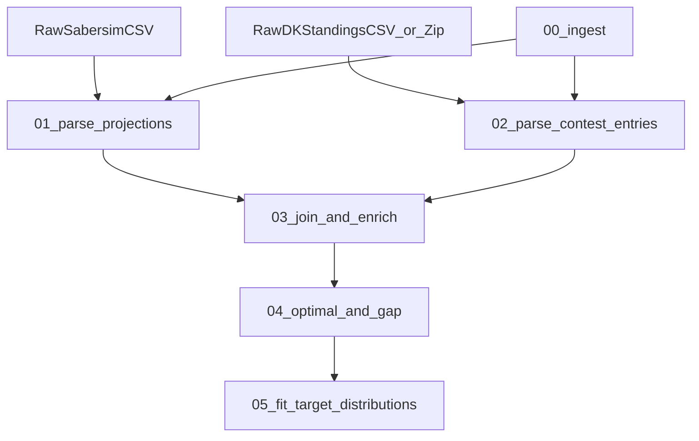

# Plan: Project Skeleton + Pipeline A

## Scope

- Build the **project skeleton** (packaging + tooling + CLI + artifact writer) so Pipeline A can run reproducibly and leave debuggable run artifacts.
- Implement **Pipeline A** exactly per canonical steps in [`agent/PIPELINES.md`](/home/john/showdown-optimizer-v2/agent/PIPELINES.md) and schemas in [`agent/DATA_CONTRACTS.md`](/home/john/showdown-optimizer-v2/agent/DATA_CONTRACTS.md).
- Segmenting defaults to **EntryName suffix parsing** (e.g., `"name (60/150)"`) and brute-force optimal lineup computation.

## Decisions (locked)

- **Contest segment heuristics**: infer `max_entries_per_user` from `EntryName` suffix `(k/max)` when present; **SingleEntry** if `max==1` else **MME**; `contest_size` = number of rows (or unique `EntryId`) in the standings file; size bins are **configurable**.
- **Optimal solver**: brute force (reference script-style), with caching per slate.

## Target repo skeleton

Create and use the canonical structure from [`agent/ARCHITECTURE.md`](/home/john/showdown-optimizer-v2/agent/ARCHITECTURE.md):

- [`src/dfs_opt/`](/home/john/showdown-optimizer-v2/src/dfs_opt/) (package)
- [`tests/`](/home/john/showdown-optimizer-v2/tests/) (unit + golden tests)
- [`scripts/`](/home/john/showdown-optimizer-v2/scripts/) remains thin wrappers only

## Packaging/tooling setup

Add baseline dev tooling and a repeatable entrypoint:

- Create [`pyproject.toml`](/home/john/showdown-optimizer-v2/pyproject.toml)
  - Dependencies: `pandas`, `numpy`, `pydantic`, `pyyaml`, `typer`, `rich` (optional), `pyarrow` (for parquet), `structlog` (or stdlib logging)
  - Dev deps: `pytest`, `ruff`, `black`, `isort` (and optionally `mypy`)
  - CLI entrypoint: `dfs-opt` → `dfs_opt.cli.main:app`
- Expand [`README.md`](/home/john/showdown-optimizer-v2/README.md)
  - How to install/run Pipeline A on your sample data under [`data/historical/`](/home/john/showdown-optimizer-v2/data/historical/)

## Pipeline A dataflow (high-level)

## Implementation plan by step (Pipeline A)

### Shared infrastructure (required for every step)

Implement once and reuse across steps:

- **Config**: [`src/dfs_opt/config/settings.py`](/home/john/showdown-optimizer-v2/src/dfs_opt/config/settings.py)
  - `TrainingConfig` with: `data_root`, `artifacts_root`, `sports`, `slates`, `seed`, `persist_step_outputs`, `segment_definitions`, `gpp_category` filter, and IO patterns for projections + contests.
  - `segment_definitions` includes size bins and category naming scheme (e.g., `nba-showdown-mme-1k-10k`).
- **Models / schemas**: [`src/dfs_opt/models/`](/home/john/showdown-optimizer-v2/src/dfs_opt/models/)
  - `ParsedLineup`, `PlayersFlexRow`, `EntryRow`, `EnrichedEntryRow` (pydantic/dataclasses as appropriate)
  - `StepManifest`, `RunManifest` per [`agent/DATA_CONTRACTS.md`](/home/john/showdown-optimizer-v2/agent/DATA_CONTRACTS.md)
- **Artifacts**: [`src/dfs_opt/io/artifacts.py`](/home/john/showdown-optimizer-v2/src/dfs_opt/io/artifacts.py)
  - `ArtifactWriter` to create `artifacts/<pipeline>/<run_id>/steps/<NN_name>/` and write:
    - `preview.csv` (<=200)
    - `schema.json`
    - `step_manifest.json`
  - Utilities for `schema_fingerprint`, `data_fingerprint`, and `sha256` checksums.
- **Stable hashing**: [`src/dfs_opt/utils/hashing.py`](/home/john/showdown-optimizer-v2/src/dfs_opt/utils/hashing.py)
  - `lineup_hash = sha256(canonical_lineup_string_utf8)` where canonical lineup string is `CPT:<norm_name>|UTIL:<norm_name>|...`.

### 00. ingest

File(s):

- [`src/dfs_opt/io/inventory.py`](/home/john/showdown-optimizer-v2/src/dfs_opt/io/inventory.py)
- [`src/dfs_opt/pipelines/training.py`](/home/john/showdown-optimizer-v2/src/dfs_opt/pipelines/training.py)

Work:

- Locate inputs under `data/raw/dk-results/showdown/{sport}/{slate}/` per [`prompts/pipeline_a.md`](/home/john/showdown-optimizer-v2/prompts/pipeline_a.md) (repo has samples in [`data/historical/raw/`](/home/john/showdown-optimizer-v2/data/historical/raw/)).
- Support DK exports as:
  - `.csv` already extracted, and
  - `.zip` in `contests/` (extract to a temp folder under the run’s artifacts, record checksums)
- Write an inventory table into step preview and record all input checksums.

### 01. parse_projections

File(s):

- [`src/dfs_opt/parsing/sabersim.py`](/home/john/showdown-optimizer-v2/src/dfs_opt/parsing/sabersim.py)

Work:

- Read Sabersim CSV(s), normalize to canonical columns in DATA_CONTRACTS:
  - Keep **one FLEX row per player** (lowest salary per normalized player name)
  - Emit `players_flex` with `player_name`, `name_norm`, `team`, `salary`, `proj_points`, optional `minutes`, `position`.
- Record metrics: `num_players`, `dropped_zero_proj`, `name_normalization_changes`.

### 02. parse_contest_entries

File(s):

- [`src/dfs_opt/parsing/dk_standings.py`](/home/john/showdown-optimizer-v2/src/dfs_opt/parsing/dk_standings.py)
- [`src/dfs_opt/parsing/dk_lineup.py`](/home/john/showdown-optimizer-v2/src/dfs_opt/parsing/dk_lineup.py)

Work:

- Read standings CSV and map columns to canonical names (at minimum `Lineup` → `lineup_str`, plus `EntryId`, `EntryName`, `Points`, `Rank` when present).
- Parse `lineup_str` (format `CPT <name> UTIL <name> ...`) into slots and build `lineup_hash`.
- Segment inference helpers:
  - Parse `EntryName` suffix `(k/max)` → `max_entries_per_user`
  - Compute `contest_size` from row count
- Metrics: `parse_success_rate`, `invalid_lineup_rows`.

### 03. join_and_enrich

File(s):

- [`src/dfs_opt/features/enrich_showdown.py`](/home/john/showdown-optimizer-v2/src/dfs_opt/features/enrich_showdown.py)

Work:

- Join entry slots to `players_flex` by normalized name; compute:
  - `salary_used`, `salary_left`
  - `proj_points`
  - `stack_pattern` + `heavy_team` (two-team showdown; `4-2`, `3-3`, etc.)
  - `cpt_team`
  - `cpt_archetype` using configurable salary-rank tiers (default compatible with reference script)
  - `dup_count` by `lineup_hash` within contest
- Track and report `unmatched_player_names`, `join_coverage`.

### 04. optimal_and_gap

File(s):

- [`src/dfs_opt/features/optimal.py`](/home/john/showdown-optimizer-v2/src/dfs_opt/features/optimal.py)

Work:

- Compute `optimal_proj_points` per slate via brute force:
  - 1 CPT (1.5x salary+proj) + 5 UTIL, cap 50k
  - Ignore players with `proj_points <= 0` by default
  - Cache by `(slate_id, projection_file_hash, rules_hash)` within a run
- Add `proj_gap_to_optimal = optimal_proj_points - proj_points`.
- Metrics: `optimal_value`, `compute_time_s`.

### 05. fit_target_distributions

File(s):

- [`src/dfs_opt/distributions/fit.py`](/home/john/showdown-optimizer-v2/src/dfs_opt/distributions/fit.py)
- [`src/dfs_opt/distributions/schemas.py`](/home/john/showdown-optimizer-v2/src/dfs_opt/distributions/schemas.py)

Work:

- For each segment bucket (sport + format + size bin + entry-type): compute and write versioned JSON:
  - salary_left bins
  - proj_gap bins
  - stack_pattern frequencies
  - cpt_archetype frequencies
  - duplication histogram
- Ensure validation: sums to 1.0 (within tolerance), counts match, include p50/p90/mean.
- Write `target_distributions.json` and optionally split files as in DATA_CONTRACTS.

## CLI + execution

File(s):

- [`src/dfs_opt/cli/main.py`](/home/john/showdown-optimizer-v2/src/dfs_opt/cli/main.py)
- [`src/dfs_opt/pipelines/training.py`](/home/john/showdown-optimizer-v2/src/dfs_opt/pipelines/training.py)

CLI behaviors:

- `dfs-opt training run --config path/to/config.yaml`
- Optional: `--gpp-category nba-showdown-mme-1k-10k` (runs only that segment)
- Always writes full artifact tree under `artifacts/training/<run_id>/...`.

## Tests (what will exist before calling Pipeline A “done”)

Add tests under [`tests/`](/home/john/showdown-optimizer-v2/tests/):

- **Unit tests**
  - DK lineup parsing (`CPT/UTIL`) including malformed rows
  - Name normalization + stable `lineup_hash`
  - Stack pattern + heavy team classification
  - Archetype assignment from salary ranks
  - Distribution fitting sums/edges
- **Golden tests**
  - Run enrich step on a tiny fixture contest and compare key columns against [`data/historical/enriched/enriched_entries_example.csv`](/home/john/showdown-optimizer-v2/data/historical/enriched/enriched_entries_example.csv) (row count + selected columns; allow small tolerances on floats)
- **Artifact/manifest tests**
  - Ensure `run_manifest.json` exists
  - Ensure each step writes `step_manifest.json`, `preview.csv`, `schema.json`

## Acceptance criteria

- Running Pipeline A on a known slate under [`data/historical/raw/`](/home/john/showdown-optimizer-v2/data/historical/raw/) produces:
  - `entries_enriched.parquet`
  - `target_distributions.json` (and/or per-distribution JSON files)
  - all step artifacts in the required folder structure
- `--gpp-category ...` restricts outputs to that segment.
- `pytest -q` passes and covers core transforms.

## Rollout (vertical slices)

Follow [`agent/WORKFLOW.md`](/home/john/showdown-optimizer-v2/agent/WORKFLOW.md):

- Slice 1: parsing modules + unit tests
- Slice 2: enrich features + unit tests
- Slice 3: pipeline runner + artifact writing + manifest tests
- Slice 4: optimal+gap + tests
- Slice 5: distributions + golden test + CLI