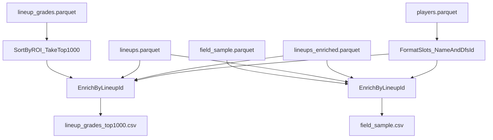

# Pipeline B: per-contest CSV exports

## Goal

At the end of Pipeline B (contest pipeline), write human-readable CSVs **alongside existing per-contest parquet outputs**:

- `field_sample.parquet` → `field_sample.csv`
- `lineup_grades.parquet` → `lineup_grades_top1000.csv` (sorted by **ROI desc**, tie-break **lineup_id asc**)

Both CSVs should show lineup slots as **`Name (DFS ID)`** and include **lineup projection**, **salary_used**, and **avg_corr**.

## Where this fits in the pipeline

Pipeline B already writes the needed inputs:

- Per contest: `contests/<contest_id>/field_sample.parquet` and `contests/<contest_id>/lineup_grades.parquet` in [`src/dfs_opt/pipelines/contest.py`](/home/john/showdown-optimizer-v2/src/dfs_opt/pipelines/contest.py)
- Run-level lookup tables:
  - `players.parquet` (contains `player_name`, `name_norm`, and usually `dfs_id` from Sabersim parsing)
  - `lineups.parquet` (slot indices `cpt,u1..u5` plus `salary_used`, `proj_points`)
  - `lineups_enriched.parquet` (adds `avg_corr` among other features)

`lineup_id` is used as a **row index** into `lineups.parquet` / `lineups_enriched.parquet` (see usage in grading + DKEntries fill).

## Output specs

### 1) `contests/<contest_id>/field_sample.csv`

Source: `field_sample.parquet` (columns: `lineup_id`, `dup_count`).

Write CSV with columns:

- `lineup_id`
- `dup_count`
- `cpt`, `util1`, `util2`, `util3`, `util4`, `util5` (each formatted as `Name (DFS ID)`)
- `proj_points`
- `salary_used`
- `avg_corr`

### 2) `contests/<contest_id>/lineup_grades_top1000.csv`

Source: `lineup_grades.parquet` (includes `lineup_id`, `roi`, `exp_winnings`, `top_*` rates).

Process:

- Sort by `roi` desc, then `lineup_id` asc.
- Take top `min(1000, n_rows)`.

Write CSV with columns:

- `lineup_id`
- `roi`
- `exp_winnings`
- `top_0_1_pct`, `top_1_pct`, `top_5_pct`, `top_20_pct`
- `cpt`, `util1..util5` (`Name (DFS ID)`)
- `proj_points`
- `salary_used`
- `avg_corr`

## Implementation approach

### Add a small export helper module

Create a focused helper (new file) to keep `contest.py` readable:

- [`src/dfs_opt/io/contest_exports.py`](/home/john/showdown-optimizer-v2/src/dfs_opt/io/contest_exports.py)

Responsibilities:

- Load only required columns from `players.parquet`, `lineups.parquet`, and `lineups_enriched.parquet`.
- Provide a fast `format_player(idx) -> str` that returns `"{player_name} ({dfs_id})"` (fall back to `player_name` if `dfs_id` missing; fall back to `str(idx)` if name missing).
- Vectorized enrichment:
  - For a set of `lineup_id`s, fetch slots from `lineups.parquet` (`iloc[lineup_ids]`).
  - Fetch `proj_points`/`salary_used` from `lineups.parquet` and `avg_corr` from `lineups_enriched.parquet`.
  - Convert slot indices to formatted strings via `players_df`.

### Wire it into the contest pipeline end

In [`src/dfs_opt/pipelines/contest.py`](/home/john/showdown-optimizer-v2/src/dfs_opt/pipelines/contest.py):

- After step **07** (or immediately after step **06**; but “end of run” means after 07 is safest), iterate `per_contest_rows` and:
  - Read `field_sample.parquet`, enrich, write `field_sample.csv` next to it.
  - Read `lineup_grades.parquet`, sort+head(1000), enrich, write `lineup_grades_top1000.csv` next to it.
- Register both CSVs in `run_outputs` (so they appear in `run_manifest.json`) and optionally include them in a new `writer.write_step` (e.g., step **08_export_csv_outputs**) so they get a `steps/08_.../preview.csv` entry too.

### Update docs

Update [`agent/PIPELINES.md`](/home/john/showdown-optimizer-v2/agent/PIPELINES.md) to list the new per-contest CSVs alongside the parquet artifacts.

## Data flow (join diagram)

## Acceptance criteria

- After a Pipeline B run, each contest directory `contests/<contest_id>/` contains:
  - `field_sample.parquet` and `field_sample.csv`
  - `lineup_grades.parquet` and `lineup_grades_top1000.csv`
- Slot columns show **player names** (not numeric indices) and include **DFS IDs** in parentheses.
- Graded CSV has at most 1000 rows and is sorted by ROI desc with deterministic tie-break.
- Both CSVs include `proj_points`, `salary_used`, and `avg_corr`.