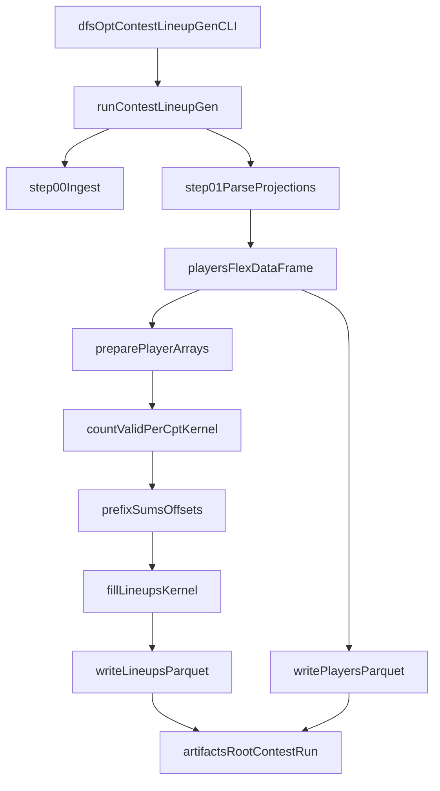

# Plan: Implement lineup-gen (enumerate showdown universe)

## Goals
- Enumerate **all valid DK NBA Showdown CPT lineups** using the approach in `prompts/lineup-gen.md` (NumPy arrays + Numba JIT + **two-pass count→fill**).
- Package this as the first runnable slice of “Pipeline B” while obeying `agent/ARCHITECTURE.md`, `agent/PIPELINES.md`, and `agent/STYLE_GUIDE.md`.
- Persist outputs under **`artifacts/lineup-gen/`** by running the contest pipeline with `--artifacts-root artifacts/lineup-gen` (canonical run structure remains `.../contest/<run_id>/...`).

## Key repo constraints we will follow
- **Canonical artifacts layout** via `dfs_opt.io.artifacts.ArtifactWriter` (step folders, `preview.csv`, `schema.json`, `step_manifest.json`) and a `run_manifest.json` at run root.
- **Purity boundary**: enumeration core stays pure (arrays in → arrays/DataFrame out); orchestration/IO lives in pipeline/CLI.
- **Stable step naming** consistent with `agent/PIPELINES.md` (we’ll extend the contest pipeline docs accordingly).

## Proposed user-facing interface
- Add a new CLI command:
  - `dfs-opt contest lineup-gen ...`
- Inputs are **explicit paths** (per your choice):
  - `--projection-csv /path/to/sabersim.csv`
  - `--slate-id <string>` (required)
  - `--sport nba` (default)
  - `--artifacts-root artifacts/lineup-gen` (default to `artifacts/lineup-gen` for this command)
  - Optional knobs:
    - `--salary-cap 50000`
    - `--min-proj 0.0` (filter players)
    - `--max-players N` (debug)
    - `--persist-step-outputs` (keeps the standard meaning)

## Pipeline structure (contest)
We’ll implement a minimal contest pipeline runner just for lineup-gen (the rest of Pipeline B can come later):

- **00_ingest**
  - Inventory: projection path + checksum (and later correlation input, if needed).
  - Emit step artifacts via `ArtifactWriter.write_step`.

- **01_parse_projections**
  - Reuse existing parser `dfs_opt.parsing.sabersim.parse_sabersim_showdown_csv` to produce canonical `players_flex`.
  - Validate showdown assumptions needed for enumeration:
    - At least 6 eligible players.
    - Exactly **two teams** present after filtering (NBA showdown).
  - Emit step artifacts.

- **02_enumerate_lineup_universe**
  - Convert `players_flex` to compact NumPy arrays (`salary:int32`, `proj:float32`, `team:uint8(0/1)`).
  - Two-pass enumeration (per `prompts/lineup-gen.md`):
    - **Kernel A**: count valid lineups per CPT.
    - Prefix sum offsets.
    - **Kernel B**: fill preallocated arrays (slot indices + computed columns).
  - Enforce legality:
    - No duplicates (by construction).
    - Salary cap: `1.5*salary[cpt] + sum(salary[utils]) <= cap`.
    - Stack legality: reject **6-0** (i.e., team sum equals 0 or 6).
  - Persist outputs:
    - Write `lineups.parquet` at run root (not only in step folder) and record it in the run manifest outputs.
    - Also write `players_flex.parquet` (or `players.parquet`) alongside so the lineup indices are resolvable.
    - Write `metadata.json` (schema, team mapping, counts, config snapshot, timings).
  - Emit step artifacts:
    - `preview.csv` is a small sample of the lineup table.
    - `schema.json` reflects the preview dataframe schema.
    - `step_manifest.json` includes:
      - `num_lineups`,
      - runtime per kernel,
      - stack pattern distribution,
      - salary_used min/max.

### Output schema (initial)
To keep output compact and universally useful for downstream simulation/ROI:
- **Slots**: `cpt`, `u1..u5` as `uint16` indices into the `players` table.
- **Computed**:
  - `salary_used` (`int32`)
  - `salary_left` (`int32`)
  - `proj_points` (`float32`) (cheap and commonly needed downstream)
  - `stack_code` (`uint8`) where 0=3-3, 1=4-2, 2=5-1

We will document this in `agent/DATA_CONTRACTS.md` as a new “Lineup Universe” artifact.

## Files/modules to add or modify
- **New** contest CLI + runner
  - Add `[src/dfs_opt/cli/contest.py](/home/john/showdown-optimizer-v2/src/dfs_opt/cli/contest.py)` and register in `[src/dfs_opt/cli/main.py](/home/john/showdown-optimizer-v2/src/dfs_opt/cli/main.py)`.
  - Add `[src/dfs_opt/pipelines/contest.py](/home/john/showdown-optimizer-v2/src/dfs_opt/pipelines/contest.py)` with `run_contest_lineup_gen(config)` (scoped to this slice).
  - Add a minimal `ContestConfig` in `[src/dfs_opt/config/settings.py](/home/john/showdown-optimizer-v2/src/dfs_opt/config/settings.py)` and matching loader in `[src/dfs_opt/config/load.py](/home/john/showdown-optimizer-v2/src/dfs_opt/config/load.py)`.

- **New** enumeration implementation (pure)
  - Add `[src/dfs_opt/lineup_pool/enumerate_universe_showdown.py](/home/john/showdown-optimizer-v2/src/dfs_opt/lineup_pool/enumerate_universe_showdown.py)`
    - `prepare_player_arrays(players_flex_df) -> PlayerArrays + metadata`
    - `enumerate_universe(arrays, salary_cap) -> LineupUniverseResult` (pure; returns numpy arrays + stats)
  - Add `[src/dfs_opt/lineup_pool/numba_kernels_showdown.py](/home/john/showdown-optimizer-v2/src/dfs_opt/lineup_pool/numba_kernels_showdown.py)`
    - `count_valid_per_cpt(...)`
    - `fill_lineups(...)`

- **Docs**
  - Update `[agent/PIPELINES.md](/home/john/showdown-optimizer-v2/agent/PIPELINES.md)` to add contest step `02_enumerate_lineup_universe` (noting it can be used by later `build_candidate_pool`).
  - Update `[agent/DATA_CONTRACTS.md](/home/john/showdown-optimizer-v2/agent/DATA_CONTRACTS.md)` for the lineup universe schema + metadata.

- **Dependencies**
  - Add `numba` to `[pyproject.toml](/home/john/showdown-optimizer-v2/pyproject.toml)`.
    - If you want to avoid new deps, we can implement a slower pure-Python enumerator as a fallback, but the doc you referenced is explicitly Numba-based.

## Determinism and ordering
- Deterministic output ordering:
  - Lineups are laid out by `cpt` increasing (via per-CPT prefix offsets), then lexicographic `(u1,u2,u3,u4,u5)`.
- All filtering decisions (min proj, team mapping) are recorded in `metadata.json` and manifests.

## Validation + tests (required)
- Add unit tests in `[tests/test_lineup_universe_showdown.py](/home/john/showdown-optimizer-v2/tests/test_lineup_universe_showdown.py)`:
  - Tiny synthetic slate with two teams and known salaries:
    - Assert **no salary_used > cap**.
    - Assert **no lineup has 6 players same team**.
    - Assert **no duplicates within lineup**.
    - Assert **row count equals** `sum(counts_per_cpt)`.
    - Assert stack_code distribution matches expected for the toy slate.
- Add a small integration-ish test that runs the new CLI/pipeline function in-memory and asserts:
  - run folder contains `run_manifest.json`.
  - step folders contain required sidecars.

## Artifacts produced (where they land)
With `--artifacts-root artifacts/lineup-gen`:
- `artifacts/lineup-gen/contest/<run_id>/run_manifest.json`
- `artifacts/lineup-gen/contest/<run_id>/steps/00_ingest/...`
- `artifacts/lineup-gen/contest/<run_id>/steps/01_parse_projections/...`
- `artifacts/lineup-gen/contest/<run_id>/steps/02_enumerate_lineup_universe/...`
- `artifacts/lineup-gen/contest/<run_id>/lineups.parquet`
- `artifacts/lineup-gen/contest/<run_id>/players.parquet`
- `artifacts/lineup-gen/contest/<run_id>/metadata.json`

## Mermaid: data flow

## Implementation todos
- `contest-cli`: Add contest CLI entry + wire into `dfs-opt`.
- `contest-config`: Add `ContestConfig` (lineup-gen subset) + loader.
- `enumerator-core`: Implement Numba two-pass enumerator + schema/stats.
- `contest-runner`: Implement `run_contest_lineup_gen` to write step artifacts + parquet + metadata.
- `docs-contracts`: Update `agent/PIPELINES.md` + `agent/DATA_CONTRACTS.md`.
- `tests`: Add unit tests for legality/determinism and artifact presence.

