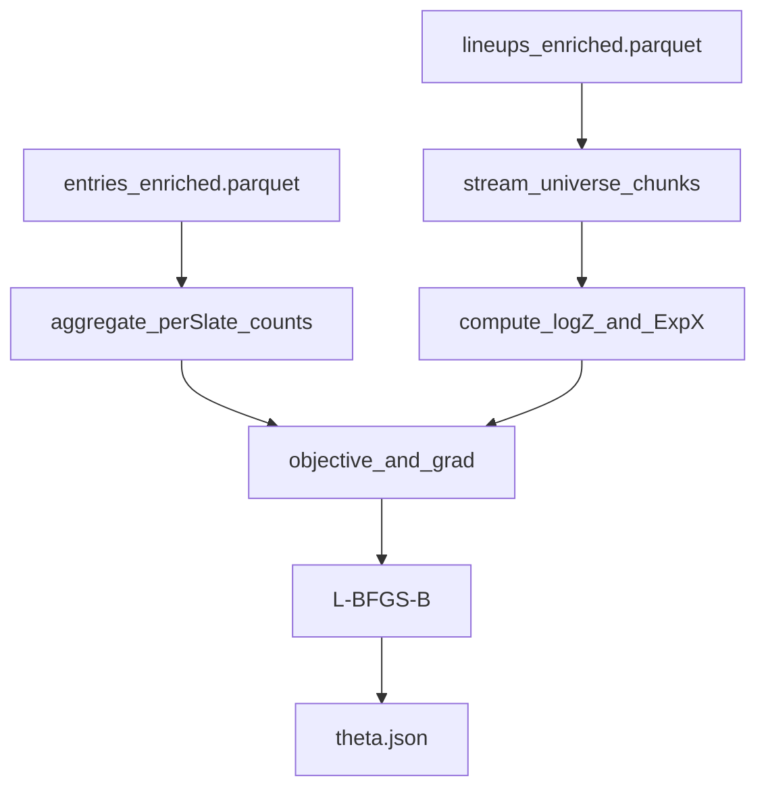

# Softmax lineup share model implementation plan

## Goals

- Implement the **v1 multinomial softmax (discrete-choice) model** specified in [`prompts/train-test.md`](/home/john/showdown-optimizer-v2/prompts/train-test.md) to predict lineup share distribution \(p(L)\) per **GPP bucket**.
- Train per bucket using:
  - **Observed historical contests** produced by Pipeline A (`entries_enriched.parquet`).
  - **Full per-slate lineup universes + features** already materialized under `data/historical/enriched/dk-results/showdown/nba/<slate_id>/lineups_enriched.parquet`.
- Produce stable, reusable artifacts (`theta.json`, `fit_metrics.json`, validation diagnostics) suitable for downstream field simulation in [`prompts/contest-sim.md`](/home/john/showdown-optimizer-v2/prompts/contest-sim.md).

## Key design decisions (confirmed)

- **Universe source**: load **precomputed** `lineups_enriched.parquet` per slate from `data/historical/enriched/...`.
- **Validation split**: **hold out entire slates** (by `slate_id`).
- **Optimizer**: add **SciPy** and use `scipy.optimize.minimize(method="L-BFGS-B")` + `scipy.special.logsumexp`.

## What already exists (we will leverage)

- Pipeline A writes per-entry training table with required features (`own_*`, `avg_corr`, bins, `dup_count`, `contest_size`, etc.) via [`src/dfs_opt/pipelines/training.py`](/home/john/showdown-optimizer-v2/src/dfs_opt/pipelines/training.py).
- Pipeline B (lineup-gen slice) writes per-slate **full universe** features (`lineups_enriched.parquet`, `metadata.json`, `players.parquet`) via [`src/dfs_opt/pipelines/contest.py`](/home/john/showdown-optimizer-v2/src/dfs_opt/pipelines/contest.py).
- Categorical labels and bins are already canonized in [`agent/DATA_CONTRACTS.md`](/home/john/showdown-optimizer-v2/agent/DATA_CONTRACTS.md).

## Implementation outline

### 1) Add configuration for universe lookup + fitting knobs

- Update [`src/dfs_opt/config/settings.py`](/home/john/showdown-optimizer-v2/src/dfs_opt/config/settings.py) `TrainingConfig` to include:
  - `universe_root: Path` (default: `data/historical/enriched`) 
  - share-model hyperparams: `share_model_lambda`, `share_model_max_iter`, `share_model_val_slate_frac`, `share_model_seed`, `share_model_enabled`.
- Update [`src/dfs_opt/config/load.py`](/home/john/showdown-optimizer-v2/src/dfs_opt/config/load.py) + [`src/dfs_opt/cli/training.py`](/home/john/showdown-optimizer-v2/src/dfs_opt/cli/training.py) to expose CLI flags.

### 2) Implement the softmax share model module

Create a new module (example path):

- [`src/dfs_opt/share_model/softmax_share.py`](/home/john/showdown-optimizer-v2/src/dfs_opt/share_model/softmax_share.py)

Responsibilities:

- **Feature schema / design matrix**
  - Define a fixed `FeatureSchema` that matches [`prompts/train-test.md`](/home/john/showdown-optimizer-v2/prompts/train-test.md):
    - Continuous: `own_score_logprod`, `own_max_log`, `own_min_log`, `avg_corr`
    - Categoricals: `cpt_archetype`, `stack_pattern`, `salary_left_bin`, `pct_proj_gap_to_optimal_bin`
    - Optional intercept
  - Ensure category levels are stable (use the fixed bin labels from `metadata.json` and/or `SegmentDefinitions`).
  - Handle universe `stack_code` by mapping to `stack_pattern` (3-3/4-2/5-1) using the `stack_code_map` already written in `metadata.json`.
  - For entries, filter or bucket any `stack_pattern` outside {`3-3`,`4-2`,`5-1`} and record warnings + counts.

- **Training data aggregation (per slate)**
  - From `entries_enriched.parquet`, aggregate to per-slate sufficient stats:
    - `N_total_s = Σ_contests contest_size`
    - `sum_yx_s = Σ_lineups y(L) * x(L)` computed from the observed unique lineups only (no join to universe needed).
    - `sum_yu_s = θ·sum_yx_s` (computed during optimization)

- **Universe expectations (streaming)**
  - For each slate’s universe, compute \(\log Z_s\) and \(E_p[x]\) without loading all rows at once:

  - Use either SciPy `logsumexp` or an online log-sum-exp accumulator to keep it stable and chunk-friendly.

- **Objective + gradient**
  - Negative log-likelihood + L2:
    - \(\text{NLL}(\theta)= -\sum_s [\sum_L y_s(L)u(L) - N_s \log Z_s] + \lambda\|\theta\|^2\)
  - Gradient per slate:
    - \(\nabla = -\sum_L y_s(L) x(L) + N_s E_{p_s}[x] + 2\lambda\theta\)

- **Artifacts**
  - `share_models/<gpp_category>/theta.json`:
    - coefficients, intercept flag, feature order, categorical levels, training metadata, version.
  - `share_models/<gpp_category>/fit_metrics.json`:
    - train/val NLL, λ, optimizer status, iterations, wall time, slates used.
  - `share_models/<gpp_category>/diagnostics/`:
    - predicted vs actual **marginals** on validation slates: `salary_left_bin`, `pct_gap_bin`, `stack_pattern`, `cpt_archetype`.
    - (optional v1.1) duplication histogram via sampling; if included, prune by probability mass (as in `prompts/contest-sim.md`).

### 3) Wire into Pipeline A as a new step

- Extend [`src/dfs_opt/pipelines/training.py`](/home/john/showdown-optimizer-v2/src/dfs_opt/pipelines/training.py) with a new stable step after target distributions:
  - `06_fit_softmax_lineup_share`
- Per `gpp_category` group:
  - Identify slates involved.
  - Load each slate’s universe from:
    - `<universe_root>/dk-results/showdown/nba/<slate_id>/lineups_enriched.parquet`
  - Fit θ on train slates; evaluate on held-out slates.
  - Write step preview rows summarizing per-category fit + output file paths.

### 4) Update specs + contracts

- Update [`agent/PIPELINES.md`](/home/john/showdown-optimizer-v2/agent/PIPELINES.md) to add the new step and outputs.
- Update [`agent/DATA_CONTRACTS.md`](/home/john/showdown-optimizer-v2/agent/DATA_CONTRACTS.md) to document:
  - `theta.json` schema
  - `fit_metrics.json` schema
  - diagnostics folder contents
- Minor doc alignment: in [`prompts/train-test.md`](/home/john/showdown-optimizer-v2/prompts/train-test.md) reconcile `value_11+` vs `value_11_plus` (use the existing code label in artifacts).

### 5) Dependencies + tests

- Add SciPy dependency in [`pyproject.toml`](/home/john/showdown-optimizer-v2/pyproject.toml).
- Tests (minimal but meaningful):
  - New unit test for the model objective/gradient consistency on a tiny universe (finite-diff gradient check) under [`tests/`](/home/john/showdown-optimizer-v2/tests).
  - Integration-ish test that:
    - Generates a tiny universe with [`src/dfs_opt/pipelines/contest.py`](/home/john/showdown-optimizer-v2/src/dfs_opt/pipelines/contest.py) in a temp dir,
    - Generates `entries_enriched.parquet` with Pipeline A fixture,
    - Fits the share model and asserts artifacts are written + NLL decreases from init.

## Rollout notes / guardrails

- Make the share-model step **optional** via `TrainingConfig.share_model_enabled` to keep Pipeline A usable when universes aren’t present.
- In the step manifest metrics, record counts of:
  - missing universe slates
  - filtered/invalid `stack_pattern`
  - any NaNs/infs detected in features