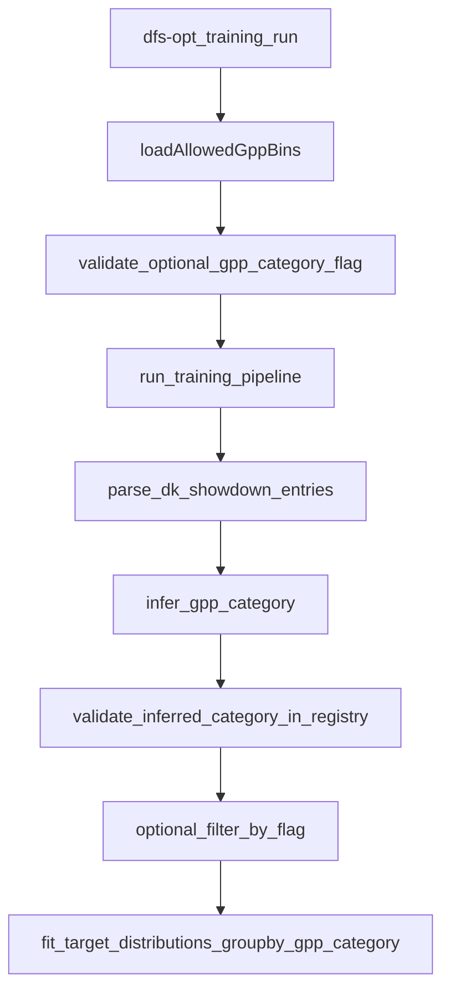

# Static GPP contest bins (Pipeline A)

## Goal

Make GPP contest categories **static and centrally defined** (not implicitly “whatever the parser infers”), while keeping `--gpp-category` as an optional CLI filter.

Concretely, Pipeline A will:

- Load a **static registry** of allowed GPP bins from a YAML file.
- Infer each contest’s bin (sport × contest_type × size_bin × entry_type).
- **Fail fast** if the inferred bin key is not present in the registry.
- If `--gpp-category` is provided, validate it is in the registry, then run only that bin.

## Current behavior (what we’re changing)

- `parse_dk_showdown_entries()` currently infers `entry_type` from `EntryName (x/y)` and returns a computed key like `nba-showdown-mme-0-1k` via `ContestSegment.gpp_category`.
- The training pipeline filters by `--gpp-category` by comparing the computed `m["gpp_category"]` to the requested string.

Key code today:

- Category construction is implicit:
  - `ContestSegment.gpp_category` in [`src/dfs_opt/parsing/dk_standings.py`](/home/john/showdown-optimizer-v2/src/dfs_opt/parsing/dk_standings.py)
- Category filter is applied in [`src/dfs_opt/pipelines/training.py`](/home/john/showdown-optimizer-v2/src/dfs_opt/pipelines/training.py)

## Proposed static registry

### File

Add a YAML file containing an **explicit list of allowed category keys** for the initial scope (NBA + NFL):

- Example keys:
  - `nba-showdown-single-entry-0-1k`
  - `nba-showdown-mme-1k-10k`
  - `nfl-showdown-mme-10k+`

We’ll still store helpful metadata per bin (readability, future-proofing), but the key point is: **the set of allowed keys is explicit and static**.

Suggested location (packaged resource):

- [`src/dfs_opt/resources/gpp_contests.yaml`](/home/john/showdown-optimizer-v2/src/dfs_opt/resources/gpp_contests.yaml)

Suggested structure:

- `version: 1`
- `bins:` list
  - `key: nba-showdown-mme-0-1k`
  - `sport: nba`
  - `contest_type: showdown`
  - `size_bin: 0-1k`
  - `entry_type: mme`
  - optional: `notes`, `active: true`

### Packaging / runtime loading

Because `dfs-opt` is an installed CLI (`pyproject.toml` uses setuptools), we should treat the bins YAML as **package data** and load it via `importlib.resources`.

Plan:

- Update [`pyproject.toml`](/home/john/showdown-optimizer-v2/pyproject.toml) to include package data for `dfs_opt.resources/*.yaml` (via `tool.setuptools.package-data`).
- Add a small loader module:
  - [`src/dfs_opt/config/gpp_bins.py`](/home/john/showdown-optimizer-v2/src/dfs_opt/config/gpp_bins.py)
  - Responsibilities:
    - Load YAML from packaged resource (default).
    - Optionally load from an override path (future-friendly).
    - Return a `set[str] `of allowed `key` values.

## Binning rules (per prompt)

We will create a bin for each combination of:

- **Sport**: initial scope `nba`, `nfl`.
- **Contest type**: for now Pipeline A is showdown-only, so `showdown` is the only contest_type we’ll register and infer.
- **Size**: `0-1k`, `1k-10k`, `10k+` (already configurable in `TrainingConfig.segment_definitions.size_bins`).
- **Num Entries (entry type)**:
  - If `max_entries_per_user` is **1–5 inclusive** → `single-entry`
  - If **>5** → `mme`
  - If cannot be inferred → treat as `mme` (conservative default), but still validate against registry.

Notes:

- The registry will be authoritative; size-bin labels used in YAML must match `SegmentDefinitions.size_bins[*].label`.

## Validation + integration points

### 1) CLI validation

In [`src/dfs_opt/cli/training.py`](/home/john/showdown-optimizer-v2/src/dfs_opt/cli/training.py):

- If `--gpp-category` is provided:
  - Load allowed keys.
  - If not present, raise a clear error:
    - includes the provided value
    - points to the bins YAML location
    - suggests how to list keys (e.g. “open the YAML”)

### 2) Parser/pipeline validation (fail fast)

In [`src/dfs_opt/pipelines/training.py`](/home/john/showdown-optimizer-v2/src/dfs_opt/pipelines/training.py) (step `02_parse_contest_entries`):

- Load allowed keys once at pipeline start.
- After `parse_dk_showdown_entries(...)` returns `(df_e, m)`:
  - Read `m["gpp_category"]` (and/or `df_e["gpp_category"]`).
  - If inferred category not in allowed set → raise exception immediately.
  - Then apply `--gpp-category` filtering as today.

This keeps the “inference” logic in one place but ensures the *set of valid outputs is static*.

### 3) Update entry-type inference

In [`src/dfs_opt/parsing/dk_standings.py`](/home/john/showdown-optimizer-v2/src/dfs_opt/parsing/dk_standings.py):

- Change entry-type rule from:
  - current: `single-entry` only when `max_entries_per_user == 1`
  - to: `single-entry` when `1 <= max_entries_per_user <= 5`

## README updates

Update [`README.md`](/home/john/showdown-optimizer-v2/README.md):

- Add a short section describing:
  - what a **GPP category/bin** is
  - the 4 axes
  - where the **static bins file** lives
  - how to run Pipeline A for a specific bin:
    - `dfs-opt training run ... --gpp-category nba-showdown-mme-1k-10k`
  - what happens when an inferred bin is not registered (**fails fast**)

## Tests

Update / add tests in [`tests/test_training_pipeline_artifacts.py`](/home/john/showdown-optimizer-v2/tests/test_training_pipeline_artifacts.py):

- Ensure the default bins file includes the existing fixture’s key (`nba-showdown-mme-0-1k`) so current tests continue to pass.
- Add a new test:
  - Modify the fixture to generate a category not in the registry (e.g. sport `nhl` or a different size_bin label) and assert the pipeline raises with the “unknown gpp_category” error.
- Add a new test for CLI validation (optional):
  - invoke the Typer command function directly with `gpp_category="not-a-real-bin"` and assert it errors.

## Data-flow diagram

## Files to change / add

- Update: [`src/dfs_opt/parsing/dk_standings.py`](/home/john/showdown-optimizer-v2/src/dfs_opt/parsing/dk_standings.py) (entry-type rule)
- Update: [`src/dfs_opt/pipelines/training.py`](/home/john/showdown-optimizer-v2/src/dfs_opt/pipelines/training.py) (load registry once; fail-fast validation; keep filter)
- Update: [`src/dfs_opt/cli/training.py`](/home/john/showdown-optimizer-v2/src/dfs_opt/cli/training.py) (validate `--gpp-category`)
- Add: [`src/dfs_opt/config/gpp_bins.py`](/home/john/showdown-optimizer-v2/src/dfs_opt/config/gpp_bins.py) (registry loader)
- Add: [`src/dfs_opt/resources/gpp_contests.yaml`](/home/john/showdown-optimizer-v2/src/dfs_opt/resources/gpp_contests.yaml) (static bins; NBA+NFL)
- Update: [`pyproject.toml`](/home/john/showdown-optimizer-v2/pyproject.toml) (package data include)
- Update: [`README.md`](/home/john/showdown-optimizer-v2/README.md) (document bins + usage)
- Update/Add: [`tests/test_training_pipeline_artifacts.py`](/home/john/showdown-optimizer-v2/tests/test_training_pipeline_artifacts.py) (registry enforcement tests)