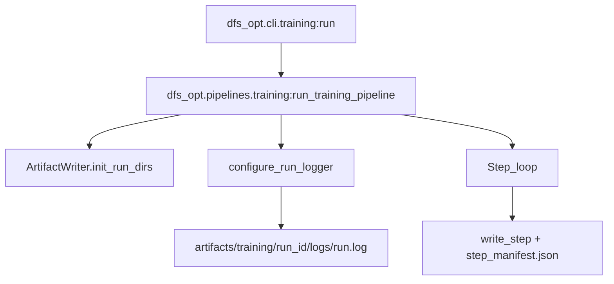

# Write run logs into artifacts

## Goals
- Write **detailed INFO logs** for every training pipeline run into `artifacts/training/<run_id>/logs/run.log`.
- Ensure log lines are **run-scoped** (include `run_id` and `pipeline`) and **step-scoped** (include step name/index where relevant).
- Keep logs **useful but bounded**: no huge data dumps; summarize counts/metrics.
- Make logging robust in tests and repeated runs in the same Python process (avoid duplicate handlers / duplicated lines).

## Current state (what we’ll leverage)
- `ArtifactWriter` already creates the run-local `logs/` directory:
  - `ArtifactWriter.logs_dir` and `init_run_dirs()` in [`/home/john/showdown-optimizer-v2/src/dfs_opt/io/artifacts.py`](/home/john/showdown-optimizer-v2/src/dfs_opt/io/artifacts.py)
- The training entrypoint `run_training_pipeline()` creates `run_id` and the run dir early, then executes steps and writes `run_manifest.json`:
  - [`/home/john/showdown-optimizer-v2/src/dfs_opt/pipelines/training.py`](/home/john/showdown-optimizer-v2/src/dfs_opt/pipelines/training.py)
- CLI entrypoint exists at [`/home/john/showdown-optimizer-v2/src/dfs_opt/cli/training.py`](/home/john/showdown-optimizer-v2/src/dfs_opt/cli/training.py)

## Proposed design
### 1) Add a small logging utility module
Create [`/home/john/showdown-optimizer-v2/src/dfs_opt/utils/logging.py`](/home/john/showdown-optimizer-v2/src/dfs_opt/utils/logging.py) that provides:
- **`configure_run_logger(*, logs_dir: Path, run_id: str, pipeline: str, level: str = "INFO") -> logging.Logger`**
  - Writes to `logs_dir / "run.log"` using `logging.FileHandler`.
  - Also writes to stderr via `StreamHandler` (still INFO) so CLI runs remain readable.
  - Uses a **Filter** (or LogRecordFactory) to ensure `run_id`/`pipeline` fields exist on every record so formatting never raises KeyError.
  - Configures a single top-level logger (recommend: `logging.getLogger("dfs_opt")`) with `propagate=False`.
  - **De-dupes handlers** (if the same log path is configured twice in-process, no duplicate file handlers).
- **`get_step_logger(base_logger: logging.Logger, *, step: str) -> logging.LoggerAdapter`**
  - Attaches `step=<NN_step_name>` context to log lines without needing to pass it manually everywhere.

Recommended plain-text format (stable + grep-friendly):
- `%(asctime)s %(levelname)s [%(pipeline)s %(run_id)s %(step)s] %(message)s`

### 2) Wire logging into the training pipeline
Update [`/home/john/showdown-optimizer-v2/src/dfs_opt/pipelines/training.py`](/home/john/showdown-optimizer-v2/src/dfs_opt/pipelines/training.py):
- After `run_id` creation and `writer.init_run_dirs()`, call `configure_run_logger(logs_dir=writer.logs_dir, run_id=run_id, pipeline="training", level="INFO")`.
- Add INFO logs at:
  - **Run start**: config summary (paths, seed, persist_step_outputs, gpp_category), git sha.
  - **Each step boundary**:
    - `Starting step 00_ingest` / `Finished step 00_ingest`.
    - Log **row_count_in/out**, and **key metrics** already computed in the step (e.g., `num_files`, `num_slates`, `num_players_total`, `num_contests`, `invalid_lineup_rows`, `unmatched_player_names`, `num_categories`).
    - Add a wall-clock duration for *compute + artifact writing* per step (wrap step compute in `time.perf_counter()` in `training.py`, not just inside `ArtifactWriter.write_step`).
  - **Important loops** at INFO (but bounded):
    - Per-slate projection parse summary (slate_id, num_players, dropped_zero_proj).
    - Per-contest parse summary (standings file, contest_size, inferred size_bin, parse_success_rate). Consider logging only the first N contests at INFO and the rest at DEBUG if volume is high.
    - Per-slate optimal compute summary (slate_id, compute_time_s, num_players_considered).
  - **Run end**: outputs written (paths), total runtime, totals (rows enriched, distributions written).
- Add a top-level `try/except` that logs `logger.exception("Training pipeline failed")` and then re-raises, so failures still produce a usable `run.log`.

### 3) (Optional but recommended) Small config hook for log level
If you want INFO by default but occasionally want more, add an optional `log_level` to `TrainingConfig` in [`/home/john/showdown-optimizer-v2/src/dfs_opt/config/settings.py`](/home/john/showdown-optimizer-v2/src/dfs_opt/config/settings.py) and wire it through [`/home/john/showdown-optimizer-v2/src/dfs_opt/config/load.py`](/home/john/showdown-optimizer-v2/src/dfs_opt/config/load.py) and the Typer CLI in [`/home/john/showdown-optimizer-v2/src/dfs_opt/cli/training.py`](/home/john/showdown-optimizer-v2/src/dfs_opt/cli/training.py).
- Default remains **INFO**.
- This keeps “detailed info logs” as the default, while enabling `--log-level DEBUG` when needed.

## Tests / acceptance criteria
Update [`/home/john/showdown-optimizer-v2/tests/test_training_pipeline_artifacts.py`](/home/john/showdown-optimizer-v2/tests/test_training_pipeline_artifacts.py):
- Assert `(run_dir / "logs" / "run.log").exists()`.
- Read `run.log` and assert it contains:
  - the `run_id` (from `run_dir.name`),
  - at least one step name like `00_ingest` and `05_fit_target_distributions`,
  - and a completion marker like `Run finished` (or similar stable phrase).

## Rollout / compatibility notes
- No changes to artifact directory structure (it already includes `logs/`).
- Logging is run-scoped: safe for local dev and CI. Handler de-duping prevents doubled lines when tests call the pipeline multiple times.

